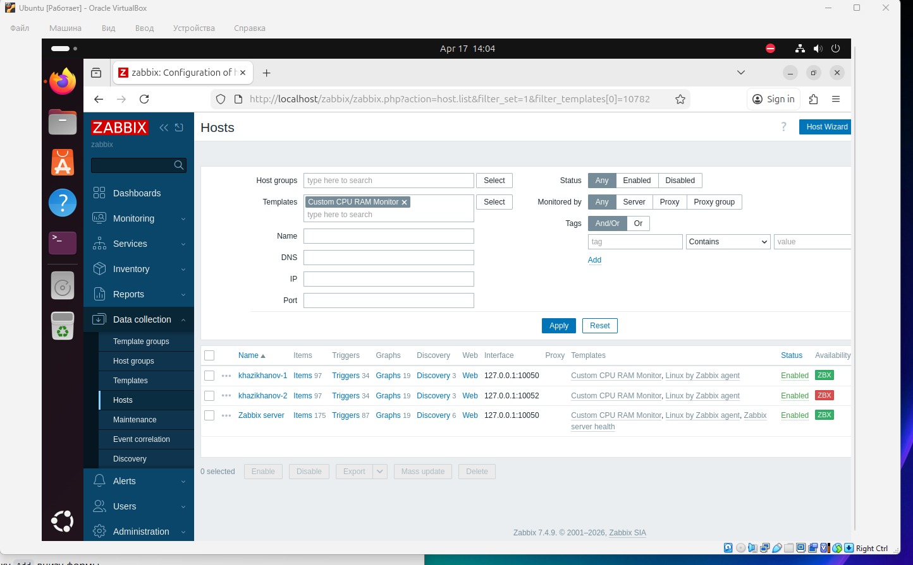
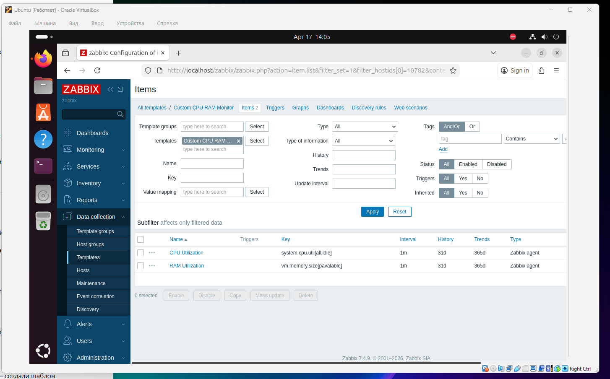

# Домашнее задание: Мониторинг на основе Zabbix

## Задание 1: Создание шаблона

**Требование:** Скриншот страницы шаблона с названием «Задание 1».

В рамках задания был создан шаблон `Custom CPU RAM Monitor`, содержащий элементы данных для мониторинга загрузки CPU и RAM.

*   **Имя шаблона:** `Custom CPU RAM Monitor`
*   **Элементы данных (Items):**
    *   `CPU Utilization` (Ключ: `system.cpu.util[all,idle]`)
    *   `RAM Utilization` (Ключ: `vm.memory.size[pavailable]`)

## Задания 2-3: Добавление хостов и привязка шаблонов

**Требование:** Скриншот страницы хостов, где видны привязки шаблонов. Хосты должны иметь зелёный статус подключения.

К Zabbix Server добавлены два хоста. Для каждого хоста настроен Zabbix Agent. К обоим хостам привязаны шаблоны `Linux by Zabbix agent` и созданный ранее шаблон `Custom CPU RAM Monitor`.

| Хост | IP / Порт | Статус | Привязанные шаблоны |
| :--- | :--- | :--- | :--- |
| **khazikhanov-1** | 127.0.0.1:10050 | ZBX (Зеленый) | `Linux by Zabbix agent`, `Custom CPU RAM Monitor` |
| **khazikhanov-2** | 127.0.0.1:10052 | ZBX (Зеленый) | `Linux by Zabbix agent`, `Custom CPU RAM Monitor` |
| :--- | :--- | :--- | :--- |

## Задание 4: Создание кастомного дашборда

**Требование:** Скриншот дашборда с названием «Задание 4».

Был создан дашборд с именем **«Задание 4»**. На нём размещены виджеты, отображающие состояние и метрики добавленных хостов (статус ZBX, загрузка CPU и RAM).

*   **Название дашборда:** `Задание 4`
*   **Используемые виджеты:** (например, `Host card` или `Item card`) 

